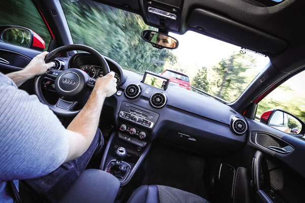
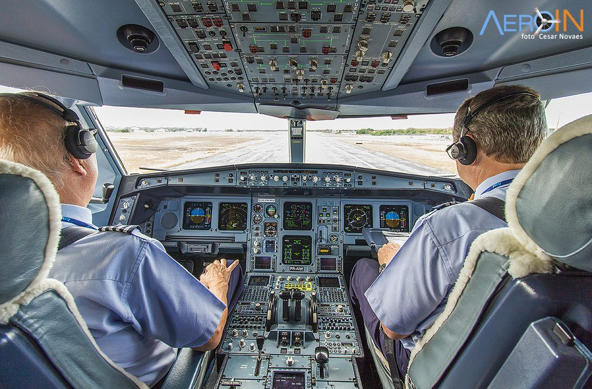
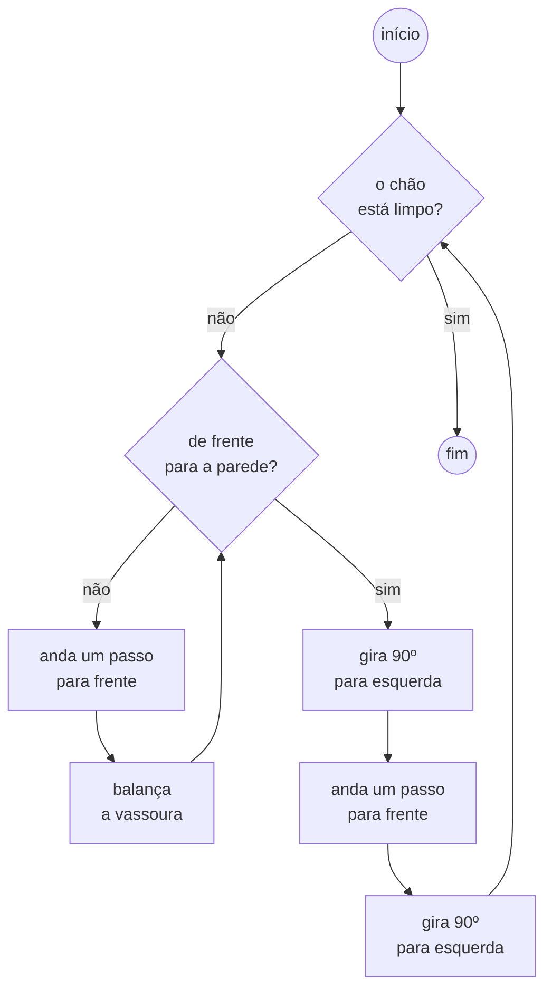

# Exercícios Pensamento Computacional

Para realizar os seguintes exercícios, é recomendado usar papel, lápis e/ou caneta.

## Exercício 1

Utilizando descrição **textual**, resolva cada um dos problemas propostos abaixo. Tente ser o mais específico 
possível, de maneira que uma pessoa que leia seu texto seja capaz de reproduzir os passos, sem precisar lhe perguntar
detalhes adicionais.

Para cada uma das tarefas, não se esqueça também de levantar as informações previamente, como por exemplo:

* **Estado inicial:** Como o ambiente se encontra antes de começarmos a trabalhar nele.
* **Objetivo:** Onde queremos chegar.
* **Ferramentas:** Os objetos ou conhecimentos que temos ao dispor para resolver o problema.
* **Instruções:** O passo-a-passo que deve ser seguido para atingirmos o objetivo, a partir do estado inicial, dispondo
                  das ferramentas disponíveis.


1. (Resolvido) Desenvolva um algoritmo para varrer o chão de uma sala vazia.

   Resposta: 

   ```
   Estado inicial: chão da sala sujo
   Objetivo: varrer todo o chão
   Ferramentas: vassoura
   Instruções:
   
   enquanto (não tiver varrido todo o chão)
       enquanto (não estiver de frente para a parede)
           balança a vassoura
           anda um passo para frente
       gira 90º para a esquerda
       anda um passo para frente
       gira 90º para a esquerda
   ```

2. Desenvolva um algoritmo para varrer o chão de uma sala de aula.

     

3. Desenvolva um algoritmo para lavar uma pilha de louça.

     

4. Desenvolva um algoritmo para lavar roupa. Leve em consideração que roupas brancas não podem ser misturadas com
   roupas coloridas.

     

5. Desenvolva um algoritmo para acessar a página do Google em um computador _Desktop_. Considere que o computador está
   desligado.

    

6. Desenvolva um algoritmo para ir de carro da universidade até sua casa. Leve em consideração os diversos aspectos
   do carro (colocar cinto, dar partida, trocar marcha, etc), e também de trânsito (parar em sinais vermelhos e placas
   de pare, seguir as direções do GPS, etc).

     

7. Desenvolva um algoritmo para **decolar** um avião (pouso não incluso). Pesquise na internet o passo-a-passo 
   necessário para esta tarefa, e transcreva este passo-a-passo para um algoritmo.


         


## Exercício 2

Para cada um dos algoritmos desenvolvidos no [Exercício 1](#exercício-1), converta-os para linguagem de fluxograma.

Exemplo 1 resolvido:


